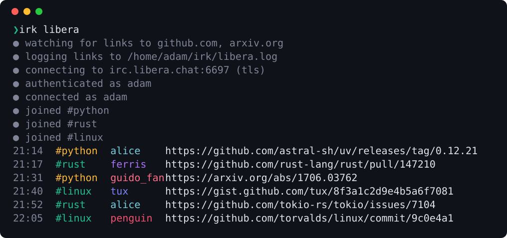

<h1 align="center">irk</h1>

<p align="center">
  <b>Sit in IRC channels and catch the links.</b><br>
  irk joins the channels you choose and prints every link to the domains you care about.
</p>

<p align="center">
  
  <a href="https://github.com/astral-sh/uv"></a>
  <a href="https://github.com/astral-sh/ruff"></a>
  
</p>

<p align="center">
  
</p>

## Why irk

- **One job.** It joins channels and prints links. There is no chat, no scrollback and nothing to
  learn.
- **Only the links you want.** Name the domains you care about and everything else is dropped.
  Subdomains count; lookalikes such as `github.com.evil.example` don't.
- **Logs in properly.** TLS with the certificate always verified, and SASL so you are identified
  before you join anything. If the login fails, irk stops rather than carry on anonymously.
- **Made for pipes.** In a terminal you get coloured columns. Piped, you get bare URLs, one per
  line, with status kept to stderr.
- **Keeps a record.** Point `log` at a file and every link is appended to it with the time it
  was seen.
- **Stays up, leaves politely.** It answers pings, notices dead connections, reconnects with
  backoff, and says `QUIT` when you stop it.
- **Nothing underneath.** No dependencies. The IRC protocol is written from scratch on asyncio.

## Install

You'll need [uv](https://docs.astral.sh/uv/).

```sh
uv tool install git+https://github.com/adamtrain/irk
```

That puts `irk` on your `PATH`. To hack on it, clone the repo and install it in editable mode,
so your changes take effect right away:

```sh
git clone https://github.com/adamtrain/irk && cd irk
uv tool install --editable .
```

## Configure

Configs live in `~/.config/irk`, one file per network. Make one, and keep it to yourself, since
it will hold a password:

```sh
mkdir -p ~/.config/irk
touch ~/.config/irk/libera.toml
chmod 600 ~/.config/irk/libera.toml
```

Then fill it in. [irk.example.toml](irk.example.toml) has every option with comments.

```toml
host = "irc.libera.chat"
nick = "your-nick"
channels = ["#python", "#rust"]
domains = ["github.com", "arxiv.org"]
log = "~/irk/libera.log"

[sasl]
password = "your-password"
```

| Key | Default | |
| --- | --- | --- |
| `host` | required | Server to connect to. |
| `nick` | required | If it is taken, irk tries `nick_`, `nick__` and `nick___`. |
| `channels` | required | Channels to join. |
| `domains` | every link | Domains to print links for, subdomains included. |
| `log` | no log | File to append every printed link to. Absolute, or starting with `~/`. |
| `tls` | `true` | The server's certificate is always verified. |
| `port` | `6697` | `6667` when `tls = false`. |
| `username` | same as `nick` | The ident irk registers with. |
| `realname` | same as `nick` | |
| `sasl.password` | no login | Leave the `[sasl]` table out to connect anonymously. |
| `sasl.username` | same as `nick` | Your account name. |

A mistake in the file is reported by name (``unknown key 'domain'``) rather than ignored. For a
server with a self-signed certificate, point `SSL_CERT_FILE` at that certificate. If
`XDG_CONFIG_HOME` is set, configs live in `$XDG_CONFIG_HOME/irk` instead.

## Usage

```sh
irk libera                    # use ~/.config/irk/libera.toml
irk libera --quiet            # links and warnings only
irk libera | tee links.txt    # piped: bare URLs, one per line
irk libera --debug            # show the raw IRC conversation
irk ./elsewhere.toml          # a config outside ~/.config/irk
irk                           # list the configs you have
```

The config is named the way [catgirl](https://git.causal.agency/catgirl/about/) does it: `irk
libera` reads `~/.config/irk/libera.toml`, or `~/.config/irk/libera` if you prefer no extension.
A name that starts with `/`, `./` or `../` is read as a path instead.

Stop irk with <kbd>Ctrl</kbd>+<kbd>C</kbd>. It sends `QUIT` and closes the connection before it
exits, and does the same if it is killed or its terminal is closed.

## Reading the output

| | |
| --- | --- |
| **`●` lines** | Status, on stderr: what irk is connecting to, who it logged in as, what it joined. `--quiet` hides them. |
| **`▲` lines** | Warnings, on stderr: a channel it couldn't join, a kick, a lost connection. Always shown. |
| **Time** | When irk saw the link, in your local time. |
| **Channel and nick** | Where the link was posted and by whom. Each keeps the same colour from run to run. |
| **Link** | The URL, with the punctuation and brackets that trail links in prose trimmed off. |

Only links posted to channels are shown, not ones sent to you privately. Set `NO_COLOR` to turn
colour off.

## The log

With `log` set, every link irk prints is also appended to that file, with the time it was seen:

```
2026-10-03T21:14:05-07:00 https://github.com/astral-sh/uv/releases/tag/0.12.21
2026-10-03T21:17:42-07:00 https://github.com/rust-lang/rust/pull/147210
```

The file is only ever added to, so one log can run across restarts for as long as you like. Its
directory is created if it is missing, and it can be rotated or removed while irk is running. A
link posted twice is logged twice. If the log can't be written, irk stops and says why.

## Options

| Flag | |
| --- | --- |
| `-q, --quiet` | Print links and warnings, but no status |
| `--debug` | Show every IRC line sent and received |
| `--version` | Show the version |
| `-h, --help` | Show help |

irk exits with `1` on problems it can't recover from (a bad config, a rejected login, a
certificate it can't verify, a log it can't write) and `130` when you stop it. A dropped
connection isn't one of those: irk waits 2 seconds and reconnects, doubling the wait up to a
minute each time it fails.

## Debugging

`--debug` prints every line sent (`→`) and received (`←`), which is the quickest way to see why
a login or a join isn't working. Your password is masked:

```
→ CAP LS 302
→ NICK adam
→ USER adam 0 * adam
← :irc.example CAP * LS :sasl=PLAIN,EXTERNAL
→ CAP REQ sasl
← :irc.example CAP * ACK :sasl
→ AUTHENTICATE PLAIN
← AUTHENTICATE +
→ AUTHENTICATE ****
← :irc.example 903 adam :SASL authentication successful
→ CAP END
← :irc.example 001 adam :Welcome to the network, adam
→ JOIN #python,#rust
```

## How it works

irk doesn't use an IRC library. It opens a TLS connection with asyncio and speaks the protocol
itself, which for this job is a small part of it: parse a line, encode a line, and a `match`
statement over the dozen or so messages that matter.

It opens with `CAP LS 302`, which makes the server hold registration open. If you configured
SASL, irk requests the `sasl` capability and sends your credentials with `AUTHENTICATE PLAIN`,
in the 400-byte chunks the spec asks for. It only sends `CAP END`, and so only gets let in, once
the server confirms the login. A server that doesn't offer SASL, or ignores capability
negotiation altogether, gets an error instead of an unauthenticated session.

To stay connected, irk answers every `PING`, including the ones some servers send before they
will finish registration. If the server says nothing for two minutes irk sends a `PING` of its
own, and if two more minutes pass in silence it treats the connection as dead and reconnects.

Everything a server sends is stripped of control characters before it is printed, so nothing in
a nick, a channel name or a link can drive your terminal.

## Development

```sh
uv sync                        # set up the environment
uv run pytest                  # run the tests
uv run ruff check && uv run ruff format --check
uv run ty check                # type-check
uv run scripts/screenshot.py   # regenerate docs/hero.svg
```

The client tests run irk against a scripted IRC server on localhost, over real sockets and real
TLS, including the real command being stopped with each signal. The screenshot is drawn from a
made-up session played through the same code irk uses to print real ones.

```
src/irk/
├── cli.py       # the command: arguments, reconnecting, signals
├── client.py    # one connection: registration, SASL, pings, joins
├── config.py    # finding and validating config files
├── links.py     # pulling links out of messages, matching domains
├── protocol.py  # parsing and encoding IRC lines, SASL payloads
└── ui.py        # everything you see, and the link log
```
